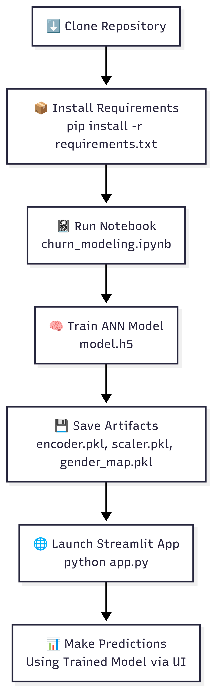

# 🔮 Customer Churn Prediction using ANN

Predicting customer churn using an **Artificial Neural Network (ANN)** trained on banking customer data. This project helps companies proactively identify customers who are likely to leave and take preventive action.

---

## 🧠 Overview

Customer churn is a critical problem in many industries, especially in banking and telecom. This project builds a classification model using a **deep learning approach (ANN)** to predict whether a customer will churn based on historical features.

---

### 🔁 Project Execution Flow

